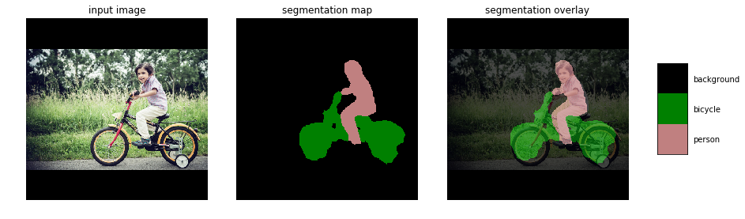
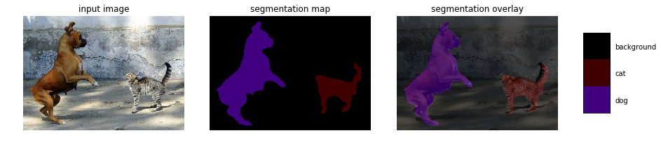
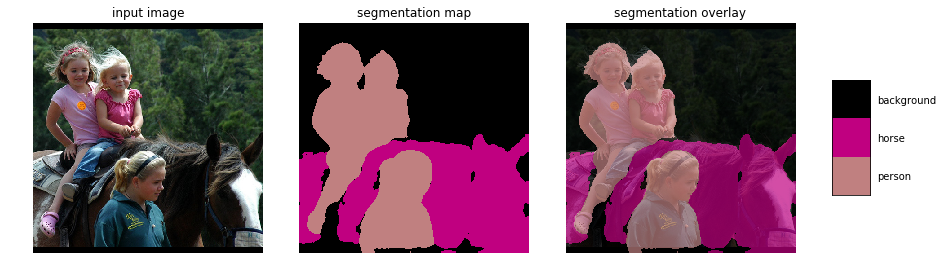

# Deep Learning Image Segmentation Demo

This project is a short demonstration showcasing my experience with deep learning using TensorFlow Keras. The goal is to perform image segmentation using a Fully Convolutional Network (FCN) implemented in `FCN.py`. The segmentation results can be visualized using `start.py`.

## Project Structure

- `FCN.py`: Fully Convolutional Network model for image segmentation.
- `start.py`: Script to perform image segmentation and visualize results.
- `hw2_data/`:
  - `images/`: Testing images.
  - `segmentation/`: Ground-truth segmentation masks.
  - `tf_segmentation/`: Predicted segmentation masks using TensorFlow Keras.
- `hw2_scripts/keras-deeplab-v3-plus/`:
  - `imgs/`: result images.

## How to Run

Run the image segmentation script:

python start.py

## Visual Results

 
 
 

 
## Note to Recruiters

This project serves as a showcase of my skills in deep learning, particularly in image segmentation using TensorFlow Keras. Feel free to explore the code in `FCN.py` and `start.py` in `hw2_scripts/` to understand the implementation details.

If you have any questions or would like to discuss the project further, please feel free to reach out.

Thank you for your time!
